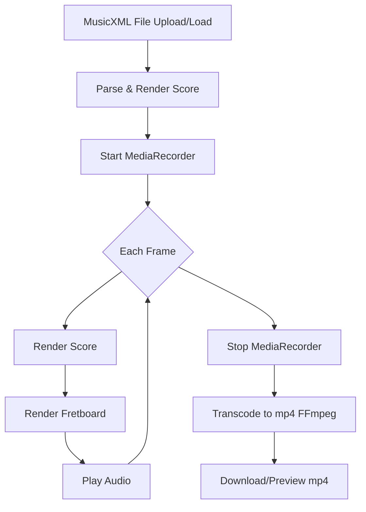

MusicXML Tablature to Video
===========================

Generate mp4 video from MusicXML Tablature.

* https://cho45.stfuawsc.com/mxml-to-video/
* https://www.youtube.com/watch?v=RKB9-qApfVE

---

## Project Structure

This project is a web application for visualizing MusicXML tablature, fretboard diagrams, and generating audio/video from scores. The main files and directories are as follows:

- **index.html**  
  Main HTML file. Defines the UI, style, and Vue app mount point.

- **script.js**  
  Main application logic. Implements the Vue.js app, score rendering, fretboard drawing, audio synthesis, video generation, and file I/O.

### lib directory

- **opensheetmusicdisplay.min.js**  
  OpenSheetMusicDisplay library for rendering scores.

- **vue.global.js**  
  Vue.js global build.

- **webaudiofont/**  
  WebAudioFont libraries and soundfonts.

### node_modules directory

- Contains npm dependencies such as FFmpeg (ESM build).

---

## Conversion Flow

---

**Roles:**

- `index.html`: UI and style
- `script.js`: Main app (Vue.js, score/fretboard/audio/video logic)
- `lib/`: External libraries and soundfonts
- `.mxl files`: Sample score data

See each file for more details.
